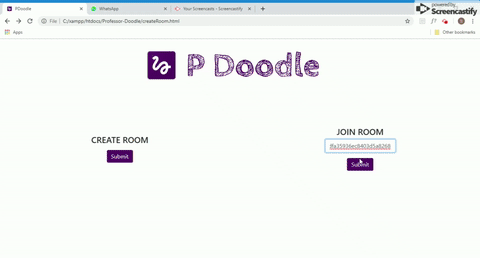

	<h1>Professor-Doodle :black_nib:</h1>
  

* Submission for [Mumbai Hackathon](https://github.com/MumbaiHackathon/) 2019

## Functionalities
* Real-Time Doodling Platform
* Create or join rooms with friends
* Works for Android apps :iphone: as well as web :computer: 
* Download your masterpiece :fire:

## Demo

	 <b>Webpage </b> 
  
	 <b>Android App</b> 
  

> <b>Note</b>: Can be used for more than 2 devices simultaneously 

<h5>View Demo Videos Here:</h5>
* [Web Page](https://github.com/shivaneej/Professor-Doodle/blob/master/Demo%20Videos/webpage.mp4)
* [Android App](https://github.com/shivaneej/Professor-Doodle/blob/master/Demo%20Videos/androidapp.mp4)

## Technology Stack
* Android Studio
* MongoDB 
* PHP
* JavaScript
* HTML, CSS, Bootstrap

## Contributors
* [Shivanee Jaiswal](https://www.github.com/shivaneej)
* [Aditya Pingle](https://www.github.com/10aditya)
* [Grusha Dharod](https://www.github.com/grushad)
* [Neelay Gosar](https://www.github.com/neelaygosar)
* [Rohan Solsi](https://www.github.com/rohansolsi)
